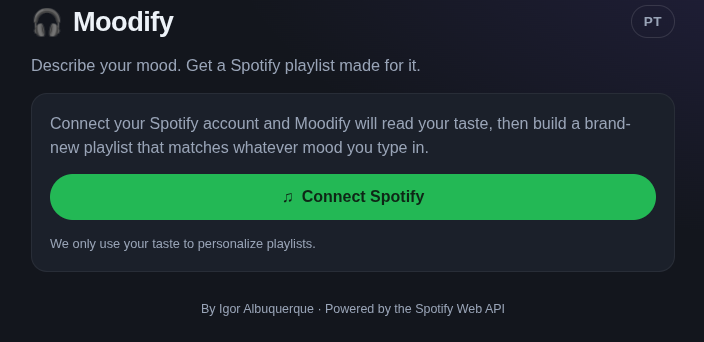
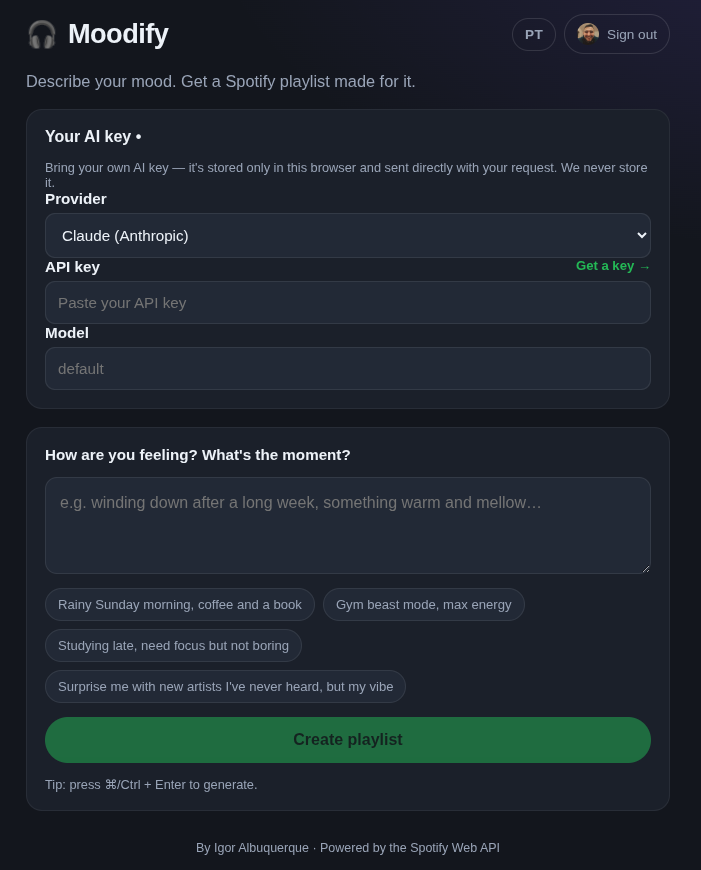
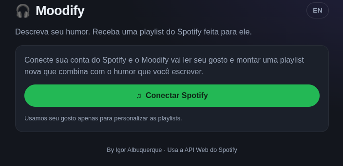
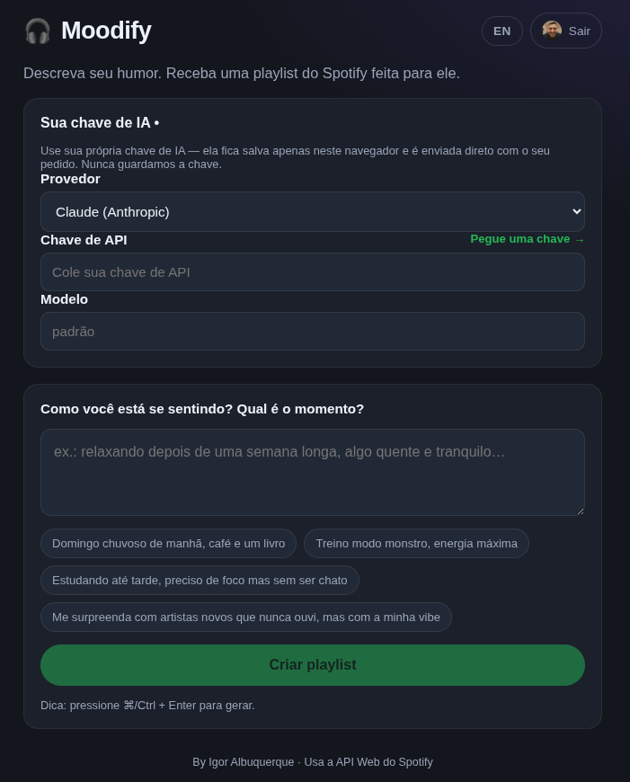
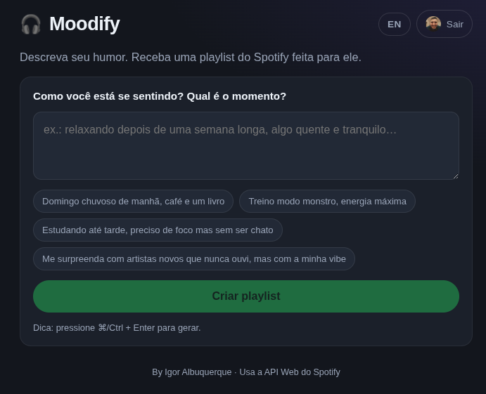

# 🎧 Moodify

**English** · [Português (pt-BR)](#-moodify--português-pt-br)

> Type how you feel → get a Spotify playlist made for it.

You describe a mood in plain words (any language) and Moodify builds a real
playlist on your Spotify account. Ask for *"something new for me"* and it
suggests artists you've never heard, based on your taste.

## 📸 Screenshots

**1 · Home**



**2 · Your AI key & mood**



---

## ▶️ Run it on your computer (beginner-friendly)

No coding needed. Just follow these steps in order. You'll need about 10 minutes.

### What you need
- A **Spotify account** (free or premium).
- An **AI key** from OpenAI or Anthropic (a few cents of usage; you paste it in the app). You'll get this in Step 5.

---

### Step 1 — Install Bun (the program that runs Moodify)

Open your **terminal** and paste one line:

**macOS / Linux:**
```bash
curl -fsSL https://bun.sh/install | bash
```

**Windows** (open *PowerShell*):
```powershell
powershell -c "irm bun.sh/install.ps1 | iex"
```

Then **close and reopen** the terminal so it knows about Bun. Check it worked:
```bash
bun --version
```
If you see a number, you're good. ✅

---

### Step 2 — Get Moodify onto your computer

Download the project (the green **Code → Download ZIP** button on the project
page) and unzip it. Or, if you have git:
```bash
git clone <the-project-URL>
```

Then open the terminal **inside the Moodify folder**:
```bash
cd Moodify
```

---

### Step 3 — Start Moodify

Run these two lines (the first one only needs to be done once):
```bash
bun install
bun run dev
```

When you see `🎧 Moodify running at http://127.0.0.1:3000`, leave this terminal
open and continue.

---

### Step 4 — Open it and connect Spotify

> 🔒 **This Spotify app is yours.** The Client ID and Client Secret you create
> here stay only on your computer (in a file that's never shared or uploaded).
> Every Moodify user makes their own — nobody sees or uses your key.

1. Open your browser at **http://127.0.0.1:3000**
   👉 Use exactly that address — not `localhost`.
2. You'll see a short **setup screen**. It shows a link to create a Spotify app
   and a special **Redirect URI** to copy. Do this:
   - Open the Spotify dashboard and log in:
     👉 **https://developer.spotify.com/dashboard**
   - Click **Create app** (or use this direct link:
     **https://developer.spotify.com/dashboard/create** ). Give it any name
     (e.g. "Moodify"). For **Redirect URI**, paste exactly the address shown on
     the setup screen:
     ```
     http://127.0.0.1:3000/api/auth/callback
     ```
   - Save. Then open the app's **Settings** and copy the **Client ID** and
     **Client Secret**.
3. Back on Moodify's setup screen, paste the **Client ID** and **Client
   Secret**, then click **Save & continue**.
4. Click **Connect Spotify** and log in. ✅

---

### Step 5 — Add your AI key

1. Open the **"Your AI key"** box.
2. Choose a provider (OpenAI or Claude) and click **"Get a key →"** — it opens
   the page where you create one. Sign in, create a key, copy it.
3. Paste the key into Moodify. It's saved only in your browser. ✅

> Tip: the cost is tiny (usually a fraction of a cent per playlist), but you do
> need a small balance on your OpenAI/Anthropic account.

---

### Step 6 — Make a playlist 🎉

Type your mood (e.g. *"rainy Sunday, coffee and a book"*), click **Create
playlist**, and it appears — playable right there and saved to your Spotify.

To stop Moodify later: go to the terminal and press **Ctrl + C**. To start it
again: `bun run dev`.

---

## 🆘 Common problems

| Problem | Fix |
| --- | --- |
| Browser says "can't connect" | Make sure the terminal still shows Moodify running, and open `http://127.0.0.1:3000` (not `localhost`). |
| `redirect_uri ... not matching` on Spotify | The Redirect URI in the Spotify dashboard must be **exactly** `http://127.0.0.1:3000/api/auth/callback`. Re-check and click **Save**. |
| "Add your own AI key" message | Open the **Your AI key** box (Step 5) and paste a key. |
| `bun: command not found` | Close and reopen the terminal after Step 1, or restart your computer. |

---

## 🌐 Sharing it / putting it on a real server (later)

The steps above are for running it on your own computer. To share it with other
people or host it online, see [`.env.example`](.env.example) — you set
`BASE_URL`, HTTPS certificate files, and (for sharing) `MOODIFY_SETUP_TOKEN`
there. Spotify requires **HTTPS** for any address that isn't `127.0.0.1`.

## 🔧 Commands

| Command | What it does |
| --- | --- |
| `bun install` | Install dependencies (once) |
| `bun run dev` | Start Moodify |
| `bun run typecheck` | Check the code types |

---
---

# 🎧 Moodify — Português (pt-BR)

[English](#-moodify) · **Português (pt-BR)**

> Escreva como você está se sentindo → receba uma playlist do Spotify feita pra isso.

Você descreve um humor com suas palavras (em qualquer idioma) e o Moodify cria
uma playlist de verdade na sua conta do Spotify. Peça *"algo novo pra mim"* e
ele sugere artistas que você nunca ouviu, com base no seu gosto.

## 📸 Telas

**1 · Início**



**2 · Sua chave de IA e humor**



**3 · Escreva seu humor**



---

## ▶️ Como rodar no seu computador (fácil pra iniciante)

Não precisa saber programar. Siga os passos na ordem. Leva uns 10 minutos.

### O que você precisa
- Uma **conta do Spotify** (grátis ou premium).
- Uma **chave de IA** da OpenAI ou Anthropic (uns centavos de uso; você cola no app). Você pega isso no Passo 5.

---

### Passo 1 — Instale o Bun (o programa que roda o Moodify)

Abra o **terminal** e cole uma linha:

**macOS / Linux:**
```bash
curl -fsSL https://bun.sh/install | bash
```

**Windows** (abra o *PowerShell*):
```powershell
powershell -c "irm bun.sh/install.ps1 | iex"
```

Depois **feche e abra** o terminal de novo, pra ele reconhecer o Bun. Confira:
```bash
bun --version
```
Se aparecer um número, está tudo certo. ✅

---

### Passo 2 — Coloque o Moodify no seu computador

Baixe o projeto (botão verde **Code → Download ZIP** na página do projeto) e
descompacte. Ou, se você usa git:
```bash
git clone <a-URL-do-projeto>
```

Depois abra o terminal **dentro da pasta Moodify**:
```bash
cd Moodify
```

---

### Passo 3 — Inicie o Moodify

Rode estas duas linhas (a primeira só precisa uma vez):
```bash
bun install
bun run dev
```

Quando aparecer `🎧 Moodify running at http://127.0.0.1:3000`, deixe este
terminal aberto e continue.

---

### Passo 4 — Abra e conecte o Spotify

> 🔒 **Esse app do Spotify é seu.** O Client ID e o Client Secret que você cria
> aqui ficam só no seu computador (num arquivo que nunca é compartilhado nem
> enviado). Cada usuário do Moodify cria o seu — ninguém vê nem usa a sua chave.

1. Abra o navegador em **http://127.0.0.1:3000**
   👉 Use exatamente esse endereço — não use `localhost`.
2. Vai aparecer uma **tela de configuração**. Ela mostra um link pra criar um
   app no Spotify e um **Redirect URI** especial pra copiar. Faça assim:
   - Abra o painel do Spotify e faça login:
     👉 **https://developer.spotify.com/dashboard**
   - Clique em **Create app** (ou use este link direto:
     **https://developer.spotify.com/dashboard/create** ). Dê qualquer nome
     (ex.: "Moodify"). No **Redirect URI**, cole exatamente o endereço mostrado
     na tela de configuração:
     ```
     http://127.0.0.1:3000/api/auth/callback
     ```
   - Salve. Depois abra **Settings** do app e copie o **Client ID** e o
     **Client Secret**.
3. De volta na tela do Moodify, cole o **Client ID** e o **Client Secret** e
   clique em **Save & continue**.
4. Clique em **Connect Spotify** e faça login. ✅

---

### Passo 5 — Adicione sua chave de IA

1. Abra a caixa **"Sua chave de IA"**.
2. Escolha um provedor (OpenAI ou Claude) e clique em **"Pegue uma chave →"** —
   abre a página pra criar uma. Faça login, crie a chave, copie.
3. Cole a chave no Moodify. Ela fica salva só no seu navegador. ✅

> Dica: o custo é mínimo (geralmente uma fração de centavo por playlist), mas
> você precisa de um pequeno saldo na sua conta da OpenAI/Anthropic.

---

### Passo 6 — Crie uma playlist 🎉

Escreva seu humor (ex.: *"domingo chuvoso, café e um livro"*), clique em
**Create playlist**, e ela aparece — tocável ali mesmo e salva no seu Spotify.

Pra parar o Moodify depois: no terminal, aperte **Ctrl + C**. Pra abrir de
novo: `bun run dev`.

---

## 🆘 Problemas comuns

| Problema | Solução |
| --- | --- |
| Navegador diz "não foi possível conectar" | Veja se o terminal ainda mostra o Moodify rodando e abra `http://127.0.0.1:3000` (não `localhost`). |
| `redirect_uri ... not matching` no Spotify | O Redirect URI no painel do Spotify precisa ser **exatamente** `http://127.0.0.1:3000/api/auth/callback`. Confira e clique em **Save**. |
| Mensagem "adicione sua chave de IA" | Abra a caixa **Sua chave de IA** (Passo 5) e cole uma chave. |
| `bun: command not found` | Feche e abra o terminal de novo após o Passo 1, ou reinicie o computador. |

---

## 🌐 Compartilhar / colocar num servidor de verdade (depois)

Os passos acima são pra rodar no seu próprio computador. Pra compartilhar com
outras pessoas ou hospedar online, veja o [`.env.example`](.env.example): lá
você define `BASE_URL`, os arquivos de certificado HTTPS e (pra compartilhar)
`MOODIFY_SETUP_TOKEN`. O Spotify exige **HTTPS** pra qualquer endereço que não
seja `127.0.0.1`.

## 🔧 Comandos

| Comando | O que faz |
| --- | --- |
| `bun install` | Instala as dependências (uma vez) |
| `bun run dev` | Inicia o Moodify |
| `bun run typecheck` | Verifica os tipos do código |
